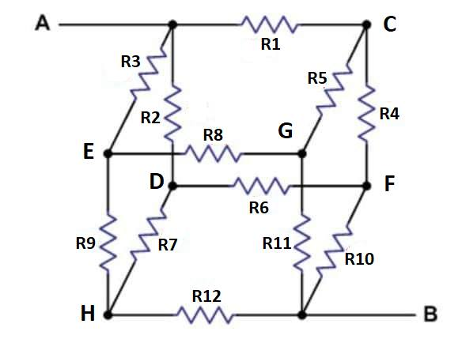

# Kubeløsning



```python
import numpy as np

# Verdier i ohm
R1=5
R2=R3=R4=R5=R6=R7=R8=R9=R10=R11=R12=1
# Verdi i volt
VAB=1

# Definer 7 spenningssirkler (Kirschoffs spenningslov)
d1 = R1+R5+R8+R3    # Øverste side
d2 = R5+R4+R10+R11  # Høyre flate
d3 = R8+R11+R12+R9  # Front flate
d4 = R7+R9+R3+R2    # Venstre flate
d5 = R2+R1+R4+R6    # Bakre flate
d6 = R6+R10+R12+R7  # Undre flate
d7 = R1+R4+R10      # Vei fra A til B igjennom forsyning VAB

# Systemmatrise - Skal være symmetrisk
A = np.array([
# I1      I2    I3   I4     I5   I6      I7
[ d1,    -R5,  -R8,  R3,    R1,   0,     R1], # Ø
[-R5,     d2, -R11,   0,    R4, R10, R4+R10], # H
[-R8,   -R11,   d3,  R9,     0, R12,      0], # F
[ R3,      0,   R9,  d4,   -R2, -R7,      0], # V
[ R1,     R4,    0, -R2,    d5, -R6,  R1+R4], # B
[  0,    R10,  R12, -R7,   -R6,  d6,    R10], # U
[ R1, R4+R10,    0,   0, R1+R4, R10,     d7]  # Power
])

# Spenningskilder
X = np.array([0, 0, 0, 0, 0, 0, VAB])

# Inverter matrisen
iA = np.linalg.inv(A)

# Regn ut A^-1 * x => y
Y = np.matmul(iA, X)

# Kun strøm i veien fra A til B vi er interessert i
I = Y[6]

# Skriv ut løsningen
print('Systemmatrise A=')
print(A)
print('X= ', X)
print('Y= ', Y)
print('R= ', VAB/I)
```

Som gir

```
Systemmatrise A=
[[ 8 -1 -1  1  5  0  5]
 [-1  4 -1  0  1  1  2]
 [-1 -1  4  1  0  1  0]
 [ 1  0  1  4 -1 -1  0]
 [ 5  1  0 -1  8 -1  6]
 [ 0  1  1 -1 -1  4  1]
 [ 5  2  0  0  6  1  7]]
X=  [0 0 0 0 0 0 1]
Y=  [-0.375  -0.4375 -0.125  -0.0625 -0.5    -0.25    1.    ]
R=  1.0
```